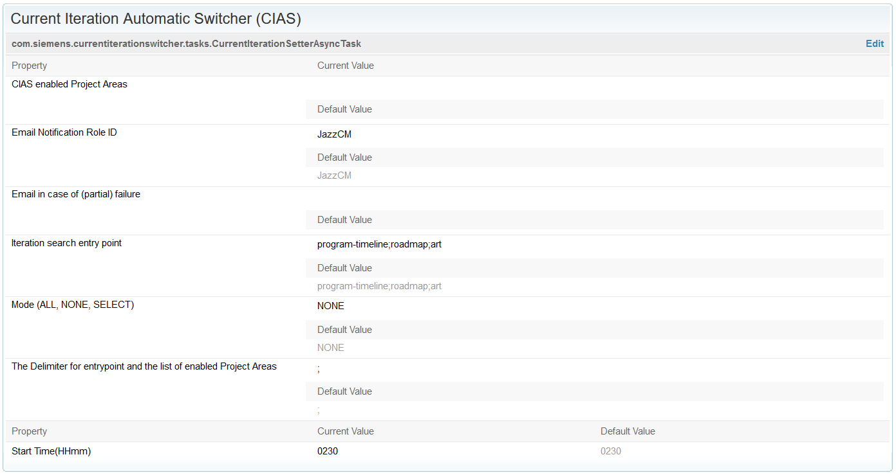

# Current Iteration Automatic Switcher
This plugin is used to change the current Iterations automatically. For this purpose it offers a asynchronous task
that can be configured in the advanced properties and a https accessible service to test it. 

## Task
The Current Iteration Automatic Switcher (CIAS) sets the current iteration (sprint) automatically once a day. In case a new iteration is set, all Jazz configuration managers are sent a notification email.

### Setup

The most convenient way to install this service is to download the current stable release from the [Releases](../../releases) page.
 If you don't already know how, head over to the [RTC Git Connector](https://github.com/jazz-community/rtc-git-connector) page to learn how to install RTC plug-ins (it's always the same procedure).

### Properties
Set under Advanced Properties on the Server Administration page.

* Mode: One of three values: ALL, NONE and SELECT. Default is NONE. When NONE is set CIAS won't run at all, SELECT only goes through the project areas specified in "CIAS enabled Project Areas" attribute and all will go through all project areas.
* CIAS enabled Project Areas: List of project areas, divided by the delimiter. If mode is set to SELECT these will be the only project areas CIAS goes through. The list is only used if mode is set to SELECT.
* Iteration search entry point: List of the IDs from the development line and its iterations, must at least reach a level where start and end date are defined. It is needed to help CIAS find the correct set of sprints to choose from. Is separated by the same delimiter as the "CIAS enabled Project Areas". Default is program-timeline;roadmap;art.
* The Delimiter for entrypoint and the list of enabled Project Areas: One or multiple chars used to separate the project areas and the entrypoint values. Should not be part of a project area name. Default is ";".
* Start Time (HHmm): The time CIAS should run. New value only takes effect after restart or after task has run. Time must be given in the military time format, e.g. a value between 0000 and 2400. The time corresponds to server time. Default is 0230 (02:30 AM).
* Email Notification Role ID: The ID of the role to be notified per email if iteration changes. Has to be ID, not name!
* Email in case of (partial) failure: optional, sends email for debugging purposes.

## Service
If you want to try it out or need it to run right away, there’s a service to start it outside of the schedule. You'll need to provide the configuration properties as URL parameters or use the defaults and it won't update the start time. It won't write to the log either, instead it returns a description of what happened with the response.

### URL
Example of the URL to start CIAS:

>https://localhost:7443/jazz/service/com.siemens.currentiterationswitcher.ICurrentIterationAutomaticSwitcher/run?mode=Select&delimiter=;&palist=P4;erwin PA&entrypoint=program-timeline;roadmap;art

Please change server name and parameters as needed.

### Defaults
If parameters are not provided following defaults will be used:

* mode: ALL
* palist: empty, since default mode is ALL
* entrypoint: program-timeline;roadmap;art
* delimiter: ;
* roleID: JazzCM
* mail: ""

###If it doesn't work
make sure mode isn't NONE.
If a current iteration is set on the wrong level, please remove it. CIAS tests if set current iteration is sensible (e.g. with current date between start and end date) before going through all.

## Contributing
Please use the [Issue Tracker](../../issues) of this repository to report issues or suggest enhancements.

For general contribution guidelines, please refer to [CONTRIBUTING.md](https://github.com/jazz-community/welcome/blob/master/CONTRIBUTING.md)

## Licensing
Copyright (c) Siemens AG. All rights reserved. 
Licensed under the [MIT](./LICENSE) License.
